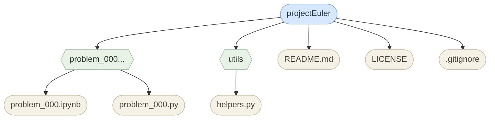

## <ins>[Project Euler Solutions](https://projecteuler.net/)</ins>

This repository contains my solutions to Project Euler problems. It is used to track which problems I have completed and keep my solutions organized. 

#### 📁 Project Structure

| Problem | Title                        | Status      |
| ------- | ----------------------------- | ----------- |
| 0       | Problem 0           | Not Started |
| 1       | Multiples of 3 or 5           | Not Started |
| 2       | Even Fibonacci Numbers        | Not Started |
| 3       | Largest Prime Factor          | Not Started |
| 4       | Largest Palindrome Product    | Not Started |
| 5       | Smallest Multiple             | Not Started |
| 6       | Sum Square Difference         | Not Started |
| 7       | 10,001st Prime                | Not Started |
| 8       | Largest Product in a Series   | Not Started |
| 8       | Largest Product in a Series   | Not Started |
| 9       | Special Pythagorean Triplet   | Not Started |
| 10      | Summation of Primes           | Not Started |
| 11      | Largest Product in a Grid     | Not Started |
| 12      | Highly Divisible Triangular Number | Not Started |
| 13      | Large Sum                     | Not Started |
| 14      | Longest Collatz Sequence      | Not Started |
| 15      | Lattice Paths                 | Not Started |
| 16      | Power Digit Sum               | Not Started |
| 17      | Number Letter Counts          | Not Started |
| 18      | Maximum Path Sum I            | Not Started |
| 19      | Counting Sundays              | Not Started |
| 20      | Factorial Digit Sum           | Not Started |
| 21      | Amicable Numbers              | Not Started |
| 22      | Names Scores                  | Not Started |
| 23      | Non-Abundant Sums             | Not Started |
| 24      | Lexicographic Permutations    | Not Started |
| 25      | 1000-digit Fibonacci Number   | Not Started |
| 26      | Reciprocal Cycles             | Not Started |
| 27      | Quadratic Primes              | Not Started |
| 28      | Number Spiral Diagonals       | Not Started |
| 29      | Distinct Powers               | Not Started |
| 30      | Digit Fifth Powers            | Not Started |
| 31      | Coin Sums                     | Not Started |
| 32      | Pandigital Products           | Not Started |
| 33      | Digit Cancelling Fractions    | Not Started |
| 34      | Digit Factorials              | Not Started |
| 35      | Circular Primes               | Not Started |
| 36      | Double-base Palindromes       | Not Started |
| 37      | Truncatable Primes            | Not Started |
| 38      | Pandigital Multiples          | Not Started |
| 39      | Integer Right Triangles       | Not Started |
| 40      | Champernowne’s Constant       | Not Started |
| 41      | Pandigital Prime              | Not Started |
| 42      | Coded Triangle Numbers        | Not Started |
| 43      | Sub-string Divisibility       | Not Started |
| 44      | Pentagon Numbers              | Not Started |
| 45      | Triangular, Pentagonal, and Hexagonal | Not Started |
| 46      | Goldbach’s Other Conjecture   | Not Started |
| 47      | Distinct Primes Factors       | Not Started |
| 48      | Self Powers                   | Not Started |
| 49      | Prime Permutations            | Not Started |
| 50      | Consecutive Prime Sum         | Not Started |